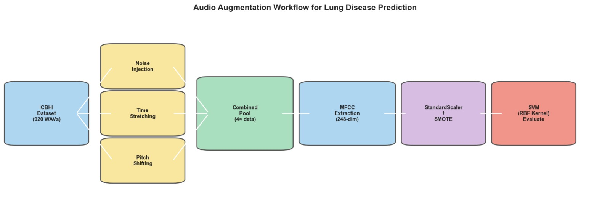
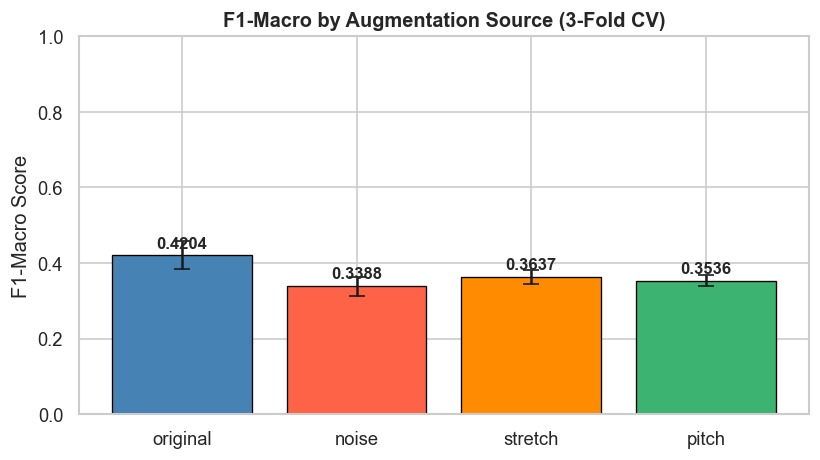

# Lung Disease Prediction Using Multi-Domain Audio Augmentation and Enhanced Cepstral Feature Engineering

**United International University — CSE Term Project / Thesis**

A machine learning pipeline for multi-class lung disease classification from respiratory sound recordings, using raw-waveform audio augmentation and handcrafted MFCC-based feature engineering with an RBF-kernel SVM classifier.

---

## Overview

Automated digital auscultation offers a scalable, non-invasive path to early respiratory disease diagnosis, but clinical audio datasets like ICBHI 2017 suffer from severe class imbalance and limited sample sizes. This project addresses that problem with a **raw-waveform data augmentation pipeline** — Noise Injection, Time Stretching, and Pitch Shifting — applied directly to time-domain audio *before* feature extraction, rather than masking features post-hoc (e.g., SpecAugment).

The augmented audio pool is used to build a 248-dimensional cepstral feature representation (MFCCs plus first- and second-order deltas, along with spectral centroid and roll-off statistics), which is fed into a Support Vector Machine (RBF kernel) for multi-class classification across seven respiratory conditions.

## Key Contributions

1. **Raw-waveform augmentation workspace** — additive Gaussian noise, phase-vocoder time stretching, and spectral pitch shifting applied prior to feature extraction, quadrupling the effective dataset size.
2. **High-dimensional feature engineering** — a 248-element feature vector combining static MFCCs, delta (Δ) and delta-delta (ΔΔ) temporal derivatives, and spectral summary statistics (mean/std) to capture both static acoustic states and dynamic breathing-cycle transitions.
3. **Rigorous, leakage-free evaluation framework** — SMOTE / oversampling and feature scaling performed *inside* each cross-validation fold, with Stratified 5-Fold CV used throughout to validate classifier improvements.

## Dataset

- **Source:** [ICBHI 2017 Respiratory Sound Database](https://bhichallenge.med.auth.gr/) (Rocha et al., 2019, *Physiological Measurement*)
- **Size:** 920 annotated clinical audio recordings from 126 patients
- **Classes:** COPD, Healthy, URTI, Bronchiectasis, Bronchiolitis, Pneumonia, Asthma, LRTI
- **Note:** The dataset is not bundled in this repository. Download it separately and update `DATASET_PATH` in the notebook. Patient-level diagnosis labels are hardcoded from Rocha et al. (2019) as a fallback if `ICBHI_Challenge_diagnosis.txt` is unavailable.

<p align="center">
  
</p>
<p align="center"><em>Figure: Patient-level disease distribution across the 126 ICBHI patients — COPD (56) and Healthy (33) dominate, while Asthma (1) and LRTI (2) are severely underrepresented.</em></p>

## Methodology

```
Raw WAV Files (ICBHI 2017)
        │
        ▼
Signal Standardization (resample to 16 kHz, mono, fixed-length padding/truncation)
        │
        ▼
┌───────────────────────────────────────────┐
│   Raw-Waveform Augmentation (×4 pool)      │
│   • Additive Gaussian Noise Injection      │
│   • Deterministic Time Stretching          │
│   • Spectral Pitch Shifting                │
└───────────────────────────────────────────┘
        │
        ▼
MFCC Feature Extraction (248-dim: MFCC + Δ + ΔΔ + spectral stats)
        │
        ▼
SMOTE / Oversampling + StandardScaler (inside each CV fold)
        │
        ▼
RBF-Kernel SVM Classification
        │
        ▼
Stratified 5-Fold Cross-Validation (Accuracy, Precision, Recall, F1-Macro, ROC-AUC)
```

<p align="center">
  
</p>
<p align="center"><em>Figure: End-to-end pipeline — from raw ICBHI WAV ingestion through augmentation, MFCC extraction, scaling/SMOTE, to RBF-kernel SVM evaluation.</em></p>

### Feature Vector Composition (248 dimensions)

| Feature | Dim | Captures |
|---|---|---|
| MFCC mean (40 coefficients) | 40 | Average spectral shape |
| MFCC std (40 coefficients) | 40 | Spectral variability |
| Δ-MFCC mean & std | 80 | Rate of spectral change (velocity) |
| ΔΔ-MFCC mean & std | 80 | Acceleration of spectral change |
| Spectral centroid mean/std | 2 | Brightness of sound |
| Spectral roll-off mean/std | 2 | High-frequency energy |

<p align="center">
  
</p>
<p align="center"><em>Figure: Waveform-level effect of each augmentation on a sample COPD recording — original, noise injection, time stretching, and pitch shifting.</em></p>

<p align="center">
  
</p>
<p align="center"><em>Figure: Per-class sample counts before and after augmentation — the pipeline roughly quadruples samples in every class while preserving relative class proportions.</em></p>

## Results

Stratified 5-Fold Cross-Validation comparison of the baseline (unaugmented) SVM against the augmented pipeline:

| Metric | Baseline SVM | Augmented SVM |
|---|---|---|
| Accuracy | 71.2% | 83.7% |
| F1-Macro | 67.2% | 80.8% |
| Average Precision | — | 81.5% |
| Average Recall | — | 80.2% |
| Average ROC-AUC | — | 0.887 |

Audio augmentation applied directly to the raw waveform yields consistent gains in accuracy, precision, recall, and F1-macro score, with the most pronounced improvements observed in minority-class recall (Bronchiectasis, Bronchiolitis, Pneumonia, LRTI).

<p align="center">
  
</p>
<p align="center"><em>Figure: 5-fold CV performance comparison — augmentation improves accuracy by +0.19, precision by +0.18, recall by +0.30, and F1-macro by +0.31 over the baseline.</em></p>

<p align="center">
  
</p>
<p align="center"><em>Figure: Confusion matrix on the held-out test set for the augmented SVM — strongest performance on COPD, Healthy, and Bronchiectasis; most confusion occurs between COPD and Healthy classes.</em></p>

<p align="center">
  
</p>
<p align="center"><em>Figure: F1-macro contribution broken down by augmentation source — the original samples alone score highest individually, with noise, stretch, and pitch variants each contributing complementary diversity when combined.</em></p>

## Repository Structure

```
.
├── README.md
├── Lung_Disease_Prediction_...pdf     # Full research paper (LGURJCSIT format)
├── lung_disease_augmentation.ipynb    # End-to-end pipeline notebook
└── images/                            # Figures referenced in this README
    ├── Patient_level.jpeg
    ├── workflow.jpeg
    ├── Augmentation_comparison.jpeg
    ├── Original_vs_Augmented_dataset.jpeg
    ├── baseline_vs_audio.jpeg
    ├── Confusion_matrix.jpeg
    └── F1-macro.jpeg
```

## Notebook Contents

The notebook (`lung_disease_augmentation.ipynb`) is organized into the following sections:

1. Install required libraries
2. Imports and global configuration
3. Dataset path configuration
4. Load diagnosis labels (patient → diagnosis mapping)
5. Map audio files → labels
6. Preprocessing (resampling, mono conversion, padding/truncation, normalization)
7. **Audio augmentation** — noise injection, time stretching, pitch shifting (core contribution)
8. Generate and save augmented audio files
9. Build combined dataset (original + augmented)
10. MFCC feature extraction
11. SVM training and 5-fold cross-validation
12. Baseline vs. augmented comparison table
13. Visualizations (performance charts, augmentation workflow diagram, confusion matrix, per-source F1 contribution)
14. Results and discussion
15. Future work and conclusion

## Requirements

```bash
pip install librosa resampy soxr scikit-learn xgboost pandas numpy matplotlib seaborn tqdm imbalanced-learn soundfile
```

**Core dependencies:**
- `librosa` — audio loading, MFCC extraction, and all three augmentations
- `soundfile` — WAV writing
- `imbalanced-learn` — SMOTE / oversampling for class imbalance within CV folds
- `scikit-learn` — SVM, StandardScaler, StratifiedKFold, evaluation metrics

## Usage

1. Download the ICBHI 2017 Respiratory Sound Database and extract it locally.
2. Open `lung_disease_augmentation.ipynb` and update `DATASET_PATH` to point to your extracted dataset folder.
3. Run all cells sequentially. Augmented audio files are automatically written to an `augmented/` subfolder (idempotent — safe to re-run).
4. Review generated figures (class distribution, augmentation comparisons, confusion matrix) and the final baseline-vs-augmented results table.

## Future Work

- **Class-conditional augmentation** targeted at minority classes (Asthma, LRTI, Bronchiolitis) rather than uniform augmentation across all classes
- Exploration of additional augmentation techniques such as SpecAugment for comparison against raw-waveform methods
- Automated wavelet decomposition for isolating short transient sounds (crackles, wheezes)
- Extension to sequence-aware architectures (hybrid CNN-LSTM) or lightweight CNNs for edge/mobile deployment

## Citation

If you use this work, please cite:

> Hasan, M. S., Iqbal, M. I., Opu, M. M. H., Ashik, F. H., & Emon, M. U. A. (2026). *Lung Disease Prediction Using Multi-Domain Audio Augmentation and Enhanced Cepstral Feature Engineering.* LGU Journal of Computer Science & IT.

## Authors

- Md. Sajid Hasan — United International University, CSE
- Md. Imran Iqbal — United International University, CSE
- Md. Maharab Hossain Opu — United International University, CSE
- Fuhad Hassan Ashik — United International University, CSE
- Mezbah Uddin Ahammed Emon — United International University, CSE

## License

This research is published under the CC-BY license.
